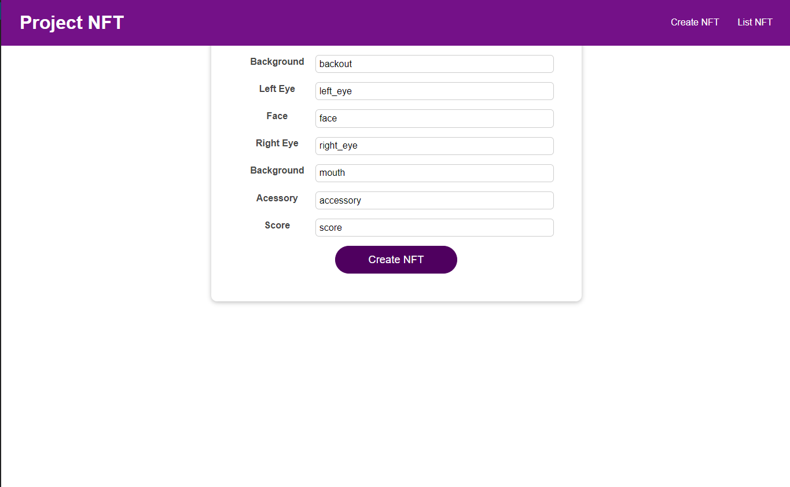

# Weekend project
* Build a web server and API for providing the features using the RESTful architecture
* Run a local node of IPFS
* Upload 10 images to this node
* Create a JSON and build metadata descriptions for 10 NFTs, each using one unique image
* Make a GET method in the API to get the metadata by id
* Deploy a NFT Collection and mint 10 NFTs, and assign the API endpoint to the token URI
* Integrate this NFT Collection contract and APIs in a frontend application to display NFTs metadata and images
* (Bonus) provide wallet functions in the frontend to buy, transfer, allow, transfer from and burn NFTs

# Smart Contract

See usage on: [README.md](https://github.com/Encode-Club-Solidity-Group-14/project_week_03/tree/main/Contract#readme)

NFT address - [0xDe3c6f253Dc24d085DBD0858598558E237774BFB](https://ropsten.etherscan.io/address/0xDe3c6f253Dc24d085DBD0858598558E237774BFB)

```
    constructor() ERC721("NFT", "GRP15") {}

    function safeMint(address to, uint256 tokenId, string memory uri)
        public
        onlyOwner
    {
        _safeMint(to, tokenId);
        _setTokenURI(tokenId, uri);
    }

    function _burn(uint256 tokenId) internal override(ERC721, ERC721URIStorage) {
        super._burn(tokenId);
    }

    function burn(uint256 tokenId) public {
        require(_isApprovedOrOwner(_msgSender(), tokenId), "ERC721: caller is not token owner nor approved");
        _burn(tokenId);
    }

    function tokenURI(uint256 tokenId)
        public
        view
        override(ERC721, ERC721URIStorage)
        returns (string memory)
    {
        return super.tokenURI(tokenId);
    }
}
```

# Backend


# Frontend





